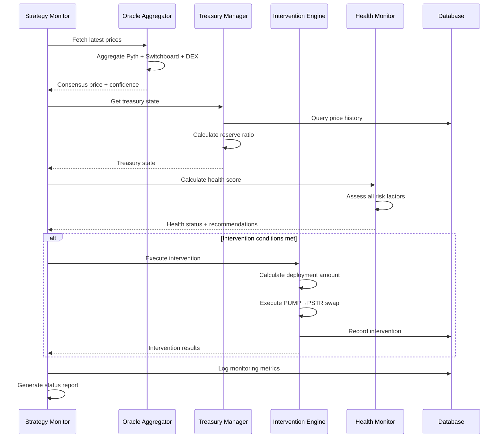

# PSTR Strategy Monitor - System Architecture

## Overview

The PSTR Strategy Monitor is a comprehensive DeFi treasury management system designed to automatically manage PUMP token accumulation, PSTR price stabilization, and liquidity provision through intelligent intervention mechanisms.

## System Architecture Diagram

```mermaid
graph TB
    %% Data Layer
    subgraph "Data Layer"
        DB[(SQLite Database)]
        PriceHistory[Price History]
        Interventions[Interventions]
        TreasurySnapshots[Treasury Snapshots]
        MonitoringLogs[Monitoring Logs]
    end

    %% Oracle Layer
    subgraph "Oracle Aggregation Layer"
        PythOracle[Pyth Network]
        SwitchboardOracle[Switchboard]
        DEXTwap[DEX TWAP]
        OracleAgg[Oracle Aggregator]
    end

    %% Core Strategy Components
    subgraph "Core Strategy Engine"
        TreasuryMgr[Treasury Manager]
        VWAPCalc[VWAP Calculator]
        InterventionEngine[Intervention Engine]
        HealthMonitor[Health Monitor]
    end

    %% Risk & Monitoring
    subgraph "Risk Management"
        RiskMgr[Risk Manager]
        AlertSystem[Alert System]
        PerformanceAnalyzer[Performance Analyzer]
        GovernanceMonitor[Governance Monitor]
    end

    %% Liquidity Management
    subgraph "Liquidity Management"
        LiquidityMgr[Liquidity Manager]
        PoolManager[Pool Manager]
        Rebalancer[Auto Rebalancer]
    end

    %% Main Controller
    StrategyMonitor[Strategy Monitor]
    
    %% External Systems
    subgraph "External Systems"
        PSTRToken[PSTR Token]
        PUMPToken[PUMP Token]
        LiquidityPools[Liquidity Pools]
        Governance[Governance System]
    end

    %% Connections
    StrategyMonitor --> TreasuryMgr
    StrategyMonitor --> InterventionEngine
    StrategyMonitor --> HealthMonitor
    StrategyMonitor --> RiskMgr
    StrategyMonitor --> LiquidityMgr

    OracleAgg --> PythOracle
    OracleAgg --> SwitchboardOracle
    OracleAgg --> DEXTwap

    TreasuryMgr --> OracleAgg
    TreasuryMgr --> DB
    VWAPCalc --> DB
    InterventionEngine --> TreasuryMgr
    InterventionEngine --> VWAPCalc
    InterventionEngine --> DB

    HealthMonitor --> TreasuryMgr
    HealthMonitor --> LiquidityMgr
    RiskMgr --> TreasuryMgr
    AlertSystem --> DB
    PerformanceAnalyzer --> DB
    GovernanceMonitor --> Governance

    LiquidityMgr --> PoolManager
    LiquidityMgr --> Rebalancer
    Rebalancer --> LiquidityPools

    DB --> PriceHistory
    DB --> Interventions
    DB --> TreasurySnapshots
    DB --> MonitoringLogs

    TreasuryMgr --> PSTRToken
    TreasuryMgr --> PUMPToken
    InterventionEngine --> PSTRToken
    InterventionEngine --> PUMPToken
```



## Core Components Breakdown

### 1. Oracle Aggregation System

**Purpose**: Provides reliable, consensus-based price feeds for decision making

**Components**:
- **Pyth Network Integration**: High-frequency price feeds with confidence intervals
- **Switchboard Oracles**: Decentralized price aggregation
- **DEX TWAP Calculation**: Volume-weighted average prices from DEX pools
- **Consensus Mechanism**: Median price calculation with deviation monitoring

**Key Features**:
- Multi-source price validation
- Automatic deviation detection (>5% triggers alerts)
- Confidence-weighted price selection
- Real-time price updates

### 2. Treasury Management System

**Purpose**: Manages PUMP token accumulation and deployment strategies

**Core Functions**:
- **Daily Budget Calculation**: `(Total Capital × Treasury Allocation) / Accumulation Period`
- **Reserve Ratio Monitoring**: `Treasury Value / PSTR Market Cap`
- **Intervention Capacity**: Dynamic calculation based on reserve strength
- **Deployment Tiers**: 10%, 25%, 40% based on drawdown severity

**Deployment Logic**:
```
Drawdown >= 30% → Tier 3 (40% deployment)
Drawdown >= 20% → Tier 2 (25% deployment)  
Drawdown >= 15% → Tier 1 (10% deployment)
Drawdown < 15%  → No intervention
```

### 3. Intervention Engine

**Purpose**: Executes automated market interventions to stabilize PSTR price

**Trigger Conditions**:
- PSTR price drops below 85% of 30-day VWAP
- Minimum 48-hour cooldown between interventions
- Reserve ratio safety checks (>1.5 minimum)
- Daily intervention limits (max 1 per day)

**Execution Process**:
1. **Price Validation**: Multi-oracle consensus check
2. **Risk Assessment**: Reserve ratio and concentration analysis
3. **Capital Calculation**: Tier-based deployment percentage
4. **Trade Execution**: PUMP → PSTR swap with slippage protection
5. **Performance Tracking**: ROI and impact measurement

### 4. Health Monitoring System

**Purpose**: Continuous assessment of system health and risk factors

**Health Score Calculation**:
```
Health Score = (Reserve Ratio × 0.333) + 
               (Intervention Capacity × 0.333) + 
               (Diversification Score × 0.334)
```

**Health Status Levels**:
- **Excellent** (≥1.5): All systems optimal
- **Good** (≥1.0): Minor adjustments needed
- **Moderate** (≥0.8): Increased monitoring required
- **Poor** (≥0.6): Intervention recommended
- **Critical** (<0.6): Emergency protocols activated

### 5. Risk Management Framework

**Purpose**: Multi-layered risk controls and safety mechanisms

**Risk Controls**:
- **Daily Limits**: Maximum 1 intervention per day
- **Reserve Protection**: Minimum 1.5x reserve ratio
- **Concentration Limits**: Maximum 80% PUMP concentration
- **Value at Risk**: 95% confidence interval calculations
- **Market Risk Assessment**: Volatility and volume analysis

**Safety Mechanisms**:
- Automatic deployment reduction if reserve ratio < 2.0
- Emergency stop if reserve ratio < 1.5
- Governance override capabilities
- Real-time alert system

### 6. Liquidity Management

**Purpose**: Optimizes liquidity provision across multiple pools

**Pool Strategy**:
- **SOL Pool**: 60% allocation (primary trading pair)
- **USDC Pool**: 40% allocation (stable value)
- **Concentration Range**: ±10% around current price
- **Auto-Rebalancing**: When price moves >15% from range center

**Capital Efficiency Metrics**:
- In-range liquidity percentage
- Impermanent loss calculations
- Fee generation tracking
- Rebalancing frequency optimization

## Data Flow Architecture



## Key Metrics & KPIs

### Financial Metrics
- **Reserve Ratio**: Treasury value / PSTR market cap
- **Intervention Success Rate**: Successful interventions / total attempts
- **Treasury Growth Rate**: 30-day compound growth
- **Sharpe Ratio**: Risk-adjusted returns
- **Maximum Drawdown**: Largest peak-to-trough decline

### Operational Metrics
- **Oracle Deviation**: Price consensus accuracy
- **Liquidity Depth**: Available trading liquidity
- **Health Score**: Composite system health indicator
- **Intervention Frequency**: Average interventions per month
- **Execution Cost**: Slippage + gas costs per intervention

### Risk Metrics
- **Value at Risk (95%)**: 1-day portfolio risk
- **Expected Shortfall**: Tail risk assessment
- **Concentration Risk**: PUMP token exposure
- **Market Risk Level**: Volatility-based risk assessment

## Configuration Parameters

### Core Strategy Settings
```python
config = {
    "total_capital": 1000000,           # Total deployment capital
    "accumulation_period": 365,         # Days for full deployment
    "treasury_allocation": 0.90,        # % for treasury management
    "liquidity_allocation": 0.10,       # % for liquidity provision
    "trigger_threshold": 0.85,          # Price drop threshold for intervention
    "cooldown_hours": 48,              # Minimum time between interventions
}
```

### Risk Management Settings
```python
risk_config = {
    "min_reserve_ratio": 3.0,          # Target reserve ratio
    "max_pump_concentration": 0.80,     # Maximum PUMP concentration
    "max_daily_interventions": 1,       # Daily intervention limit
    "max_deployment": 0.40,            # Maximum single intervention size
    "min_rr_threshold": 1.5,           # Emergency reserve threshold
}
```

### Oracle Configuration
```python
oracle_config = {
    "pyth_endpoint": "https://hermes.pyth.network",
    "switchboard_endpoint": "https://api.switchboard.xyz",
    "max_price_deviation": 0.05,        # 5% max oracle deviation
    "confidence_weight": 0.3,           # Confidence interval weighting
}
```

## Monitoring & Alerting

### Real-time Monitoring
- **5-minute monitoring cycles**: Continuous price and health assessment
- **Hourly accumulation**: Scheduled PUMP token purchases
- **Daily rebalancing**: Liquidity pool position optimization
- **6-hour performance reports**: Success rate and impact analysis
- **2-hour risk assessments**: VaR and market condition updates

### Alert System
- **Critical Alerts**: Reserve ratio < 1.5, system failures
- **Warning Alerts**: Reserve ratio < 2.0, high oracle deviation
- **Info Alerts**: Successful interventions, health improvements
- **Governance Alerts**: Proposal requirements, voting deadlines

## Governance Integration

### Proposal Types
- **Parameter Adjustments**: Threshold and limit modifications
- **Treasury Strategy**: Allocation and deployment changes
- **Protocol Upgrades**: System architecture improvements
- **Emergency Actions**: Crisis response measures

### Voting Requirements
- **Quorum Thresholds**: 10-25% based on proposal type
- **Approval Thresholds**: 51-75% based on proposal impact
- **Voting Power**: Square root scaling for large holders
- **Staking Multiplier**: 1.5x voting power for staked tokens

## Performance Optimization

### Execution Efficiency
- **Async Architecture**: Non-blocking operations for all I/O
- **Database Indexing**: Optimized queries for historical data
- **Connection Pooling**: Efficient oracle and API connections
- **Caching Strategy**: Price and state data caching

### Cost Optimization
- **Gas Estimation**: Dynamic gas price optimization
- **Slippage Protection**: Maximum 2% slippage tolerance
- **Batch Operations**: Combined transactions where possible
- **MEV Protection**: Private mempool usage

## Security Considerations

### Access Controls
- **Multi-signature Wallets**: Treasury access protection
- **Time-locked Operations**: Delayed execution for large interventions
- **Emergency Pause**: Immediate system shutdown capability
- **Governance Override**: Community control over parameters

### Oracle Security
- **Multi-source Validation**: Prevents single-point-of-failure
- **Deviation Monitoring**: Automatic detection of price manipulation
- **Confidence Intervals**: Statistical reliability assessment
- **Fallback Mechanisms**: Emergency price sources

## Future Enhancements

### Planned Features
- **Machine Learning**: Predictive intervention timing
- **Cross-chain Support**: Multi-chain treasury management
- **Advanced Analytics**: Detailed performance attribution
- **Mobile Dashboard**: Real-time monitoring interface

### Integration Opportunities
- **DeFi Protocols**: Yield farming and lending integration
- **Institutional Tools**: Professional reporting and compliance
- **API Access**: Third-party integration capabilities
- **Custom Strategies**: User-defined intervention logic

---

*This architecture provides a robust, automated system for managing PSTR token stability while maintaining healthy treasury reserves and optimal risk management.*
